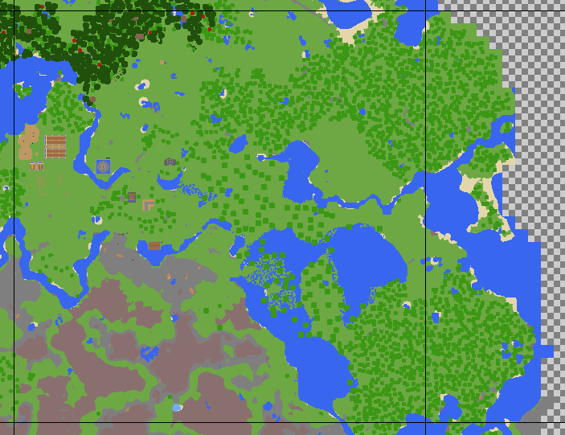

# Pwnsian Cartographer
A simple top-down Minecraft world renderer (Anvil format)

This is a work in progress.

##Building and Running
Building requires GCC 4.9 or later or any compiler with C++14 support. A QtCreater project file is provided in /src.

###Library Requirements
- cNBT (https://github.com/FliPPeh/cNBT)
- ZipLib (https://bitbucket.org/wbenny/ziplib/wiki/Home)
- Json11 (https://github.com/dropbox/json11)
- SDL2 (http://libsdl.org/)
- LodePNG (http://lodev.org/lodepng/)
- ZLib (Should probably in included with your OS)

Currently LodePNG and ZipLib are included in the sources.

