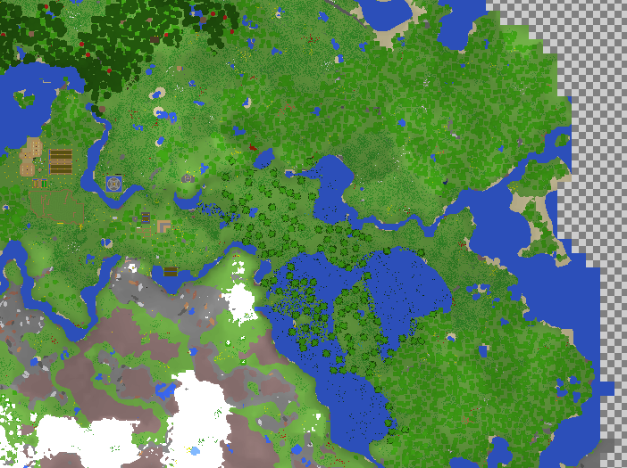

# Pwnsian Cartographer
A simple top-down Minecraft world renderer (Anvil format)



## Features
- Color, heightmap, and shaded output
- Multi-core rendering 
- Output imaging scaling (1x, 2x, ...)
- Dynamic block color generation
- Extendable and custom block support

## Usage
```
Usage:
    PwnsianCartographer <world> <render-type>
        [-g | --gridlines]
        [-i --items-zip=<filename>]
        [-t --threads=<n>]
        [-s --scale=<amount>]
        [-o --output=<file>]
    PwnsianCartographer <world> (--config-file=<file>)
    PwnsianCartographer ( -h | --help )

Options:
    render-type             Output render type. (normal, height, shaded)
    -h --help               Show this screen.
    -g --gridlines          Add region-sized gridlines to output
    -c --config-file <file> Use a configuraiton file for all options
    -i --items-zip <file>   Load block colors from this .zip file [default: items.zip]
    -s --scale <amount>     Scale output. 1x, 2x, ... [default: 1]
    -t --threads <n>        Limit number of rendering threads; 0 for #CPU Cores [default: 0]
    -o --output <file>      Place output image in file instead of in "."

```

### Config file
An optional config file can be specified with the ```--config-file``` option. The contents are the command line options without the preseeding ```--```. Specifying a config file will ignore all other command line options except for the world location.

For example:
```
;Filename of items .zip file
items-zip=items.zip

;Max number of threads to use when drawing
;Set to 0 to use number of CPU cores
threads=0
```

## Building and Running
Building requires GCC 4.9 or later or any compiler with C++14 support. This project uses CMake.

Go into the PwnsianCartographer folder:
```
git submodule init
git submodule update
mkdir build && cd build
cmake ..
make
```
This will produce the executable in the top-level directory

### Library Requirements
All used libraries are included as submodules, except for:
- SDL2 (http://libsdl.org/)
- libpng on *nix systems (Should probably be included with your OS)


